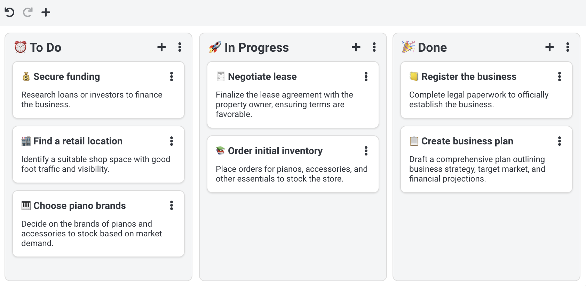

# YesYouKan - Kanban plugin for Joplin


YesYouKan is a Kanban plugin for Joplin. To begin, install the plugin, then go to the menu and select **Tools** => **Create Kanban Board**.

YesYouKan converts a note into a Kanban board format. An H1 heading represents a stack (or column), while an H2 heading serves as a card within that stack. Any text below the H2 heading acts as the card's description.

To identify a note as a Kanban board, it must include a `kanban-settings` code block at the end. This block is required, even if left empty, to ensure the note is recognised as a Kanban board.

## Example

This is how a board would look like:



For a note like this:

````markdown
# ⏰ To Do

## 💰 Secure funding

Research loans or investors to finance the business.

## 🏬 Find a retail location

Identify a suitable shop space with good foot traffic and visibility.

## 🎹 Choose piano brands

Decide on the brands of pianos and accessories to stock based on market demand.

# 🚀 In Progress

## 🧾 Negotiate lease

Finalize the lease agreement with the property owner, ensuring terms are favorable.

## 📚 Order initial inventory

Place orders for pianos, accessories, and other essentials to stock the store.

# 🎉 Done

## 📒 Register the business

Complete legal paperwork to officially establish the business.

## 📋 Create business plan

Draft a comprehensive plan outlining business strategy, target market, and financial projections.

```kanban-settings
# Do not remove this block
```
````

## Creating a note from a card

By default the entire board is contained within the same note. That can be convenient if you only have relatively small card and don't need to add much details to them. If certain cards need to be more detailed you can however convert them to actual notes. To do that, click on the card kebab button **⋮** and select **Create note from card**.

This will create a new note in the same notebook as the board and it will be linked to from the Kanban board. Now when you double-click on that card, it will open the note automatically.

When you delete this card, the associated note will also be deleted.

## Credits

- Kanban icon created by [Muhammad_Usman](https://www.flaticon.com/authors/muhammad-usman)

## License 

MIT
